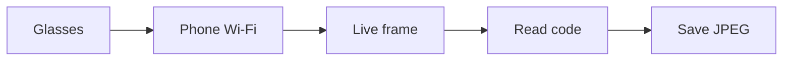

# Mentra Scanner

[](https://github.com/mrdulasolutions/Mentra-Scanner/blob/main/LICENSE) [](https://github.com/mrdulasolutions/Mentra-Scanner) [](https://docs.mentraglass.com/bluetooth-sdk/overview) [](https://github.com/mrdulasolutions/Mentra-Scanner/wiki)

**Start here:** Open the [wiki home](https://github.com/mrdulasolutions/Mentra-Scanner/wiki) and read in order—[New to Mentra](https://github.com/mrdulasolutions/Mentra-Scanner/wiki/New-to-Mentra), [Using the app](https://github.com/mrdulasolutions/Mentra-Scanner/wiki/Using-the-app), [Running the project](https://github.com/mrdulasolutions/Mentra-Scanner/wiki/Running-the-project), [How scanning works](https://github.com/mrdulasolutions/Mentra-Scanner/wiki/How-scanning-works), [Build your own app](https://github.com/mrdulasolutions/Mentra-Scanner/wiki/Build-your-own-app).

Mentra Scanner is an iPhone app for **Mentra Live** glasses. It pairs over Bluetooth, pulls live video over Wi‑Fi (WHIP/WebRTC), and saves frames when a QR code or shipping barcode stays steady in view. Parsed label fields land on your phone as JPEG files and SQLite records. This is an independent app—not an official Mentra product.

---

## What you need

| Item | Notes |
|------|--------|
| **iPhone** | iOS 16 or later. Use a real phone; the Simulator cannot run the glasses video path. |
| **Xcode** | 15+ recommended |
| **Mentra Live** | Firmware aligned with [Mentra Bluetooth SDK](https://docs.mentraglass.com/bluetooth-sdk/overview) **3.1.1+** (see `MentraQR/project.yml`) |
| **Wi‑Fi** | Phone and glasses on the same network, and that network has to let them talk to each other. |

Your first Xcode build runs `MentraQR/scripts/setup-gstreamer-ios.sh` and downloads the **GStreamer iOS SDK**. The app links GStreamer **statically**—do not embed `GStreamer.framework` in the bundle.

---

## Run it on your phone

1. Install the app (Xcode → Run, or your MDM/TestFlight flow).
2. **Connect** → pair your glasses.
3. **Settings → Wi‑Fi** → join the same network as the phone; wait for the green match banner.
4. **Scan** → tap **Start** for live view.
5. Aim a QR or barcode inside the on-screen guide. When the code is stable, the app captures automatically (toast + haptic). Open **Captures** for the full history.

On the Scan screen, **Start / Stop** runs WHIP scanning, **Save** grabs the current frame by hand, and **Clear** only clears the on-screen preview—saved files stay in Captures. The toolbar fill-light toggle drives the glasses RGB LED when supported.

---

## Open the project (developers)

```bash
cd MentraQR
brew install xcodegen   # optional; the repo already includes MentraQR.xcodeproj
xcodegen generate       # only if you changed project.yml
open MentraQR.xcodeproj
```

Pick your **Development Team** in Xcode (or set `developmentTeam` in `MentraQR/project.yml` and regenerate). Build and run on a connected iPhone.

---

## What happens when you scan

The phone listens for the glasses’ live video. When a code sits still in the guide, the app grabs that frame, reads the barcode (and label text, if you turned that on in Settings), and saves a JPEG plus the parsed fields. The stream stays up the whole time. You are not pausing for a separate photo.



Those images and fields stay on the phone. Nothing is uploaded unless you add that later.

---

## Where to go next

- **[DEVELOPER.md](DEVELOPER.md)** — build details, debugging, code map, conventions  
- **[SDK.md](SDK.md)** — how we use the Mentra Bluetooth SDK and what we built around it  
- **[ROADMAP.md](ROADMAP.md)** — what’s shipped vs planned  

```
.
├── LICENSE / NOTICE
├── README.md
├── DEVELOPER.md
├── SDK.md
├── ROADMAP.md
└── MentraQR/
    ├── MentraQR/       # iOS app sources
    ├── scripts/      # GStreamer setup, Vision probes, Laya eval
    ├── docs/           # Deep dives (e.g. Laya)
    └── project.yml     # XcodeGen spec
```

Questions and bugs can go in [GitHub Issues](https://github.com/mrdulasolutions/Mentra-Scanner/issues).

---

## Legal

Original code and documentation in this repository are **Copyright 2026 M.R. Dula Enterprise, LLC**, licensed under the [Apache License 2.0](LICENSE). Third-party components (Mentra Bluetooth SDK, GStreamer, Apple system frameworks, and others) have their own terms—see [NOTICE](NOTICE) before you redistribute a binary. “Mentra” and “Mentra Live” are trademarks of their respective owners; we use those names only to describe compatibility.
